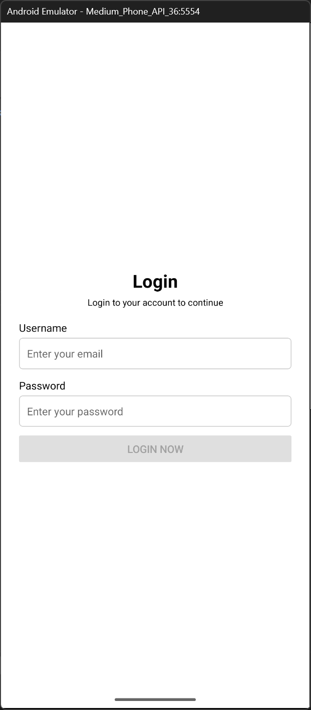
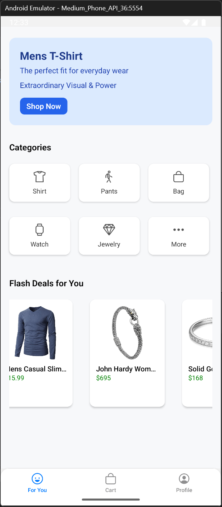
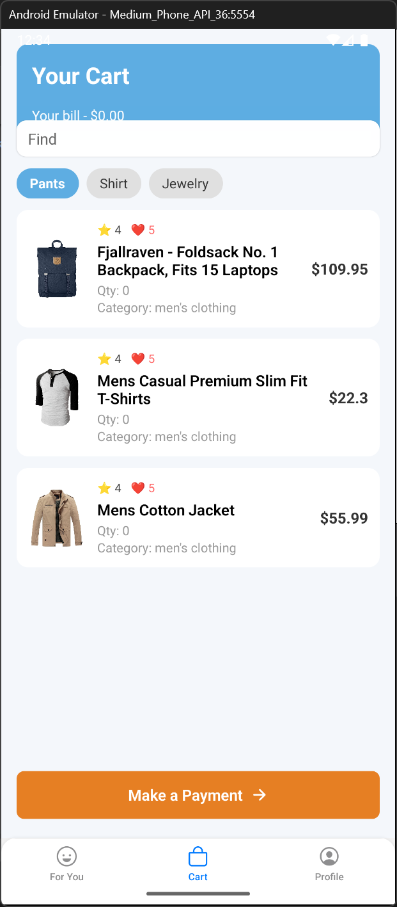
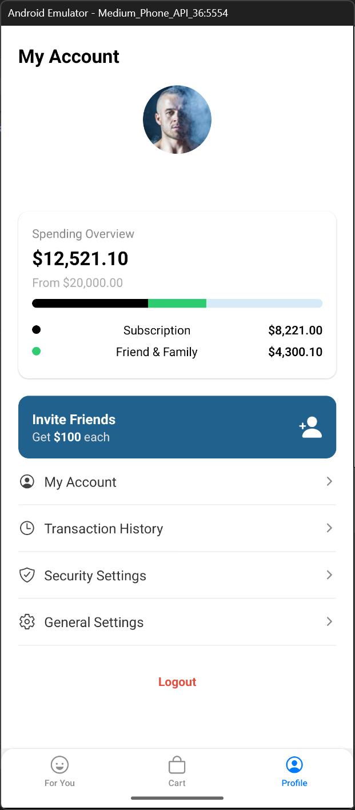

# 📱 React Native App – Submission Tugas Nortis Academy

Ini adalah proyek aplikasi mobile berbasis [**React Native**](https://reactnative.dev) yang dibuat sebagai **tugas akhir** dari program pelatihan React Native oleh **Nortis Academy**.

---

## ✨ Getting Started

### 1. Jalankan Metro Server

```bash
# dengan npm
npm start

# atau dengan yarn
yarn start
```

### 2. Jalankan Aplikasi

> Pastikan emulator Android atau perangkat iOS sudah aktif.

#### Android

```bash
npm run android
# atau
yarn android
```

#### iOS (Mac only)

```bash
bundle install
bundle exec pod install
npm run ios
# atau
yarn ios
```

---

## 🧑‍💻 Pengembangan

Untuk mulai melakukan perubahan:

1. Buka file `App.tsx`
2. Edit sesuai kebutuhan
3. Simpan dan lihat perubahan secara langsung lewat **Fast Refresh**

---

## 🔄 Hot Reload / Full Reload

- **Android**: tekan <kbd>R</kbd> dua kali atau buka Dev Menu dengan <kbd>Ctrl</kbd> + <kbd>M</kbd> / <kbd>Cmd ⌘</kbd> + <kbd>M</kbd>
- **iOS**: tekan <kbd>R</kbd> di simulator

---

## 📸 Screenshot Per Screen

### 🏠 Login Screen



### 🏠 Home Screen



### 💼 Cart Screen



### 👤 Profile Screen



### 🔍 Product Detail Screen


---

## 📚 Sumber Belajar

- [Dokumentasi React Native](https://reactnative.dev/docs/getting-started)
- [Panduan Integrasi ke Aplikasi Native](https://reactnative.dev/docs/integration-with-existing-apps)
- [React Native Blog](https://reactnative.dev/blog)
- [GitHub React Native](https://github.com/facebook/react-native)

---

## 🏁 Penutup

Terima kasih kepada **Nortis Academy** atas pelatihannya. Proyek ini adalah hasil dari pembelajaran dan implementasi materi React Native secara langsung.
